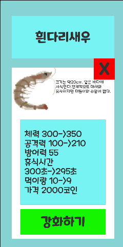

# Prawn

**화면을 클릭해서 돈을 벌고, 새우를 키우는 클리커 게임입니다.**

* GMGM동아리에서 만든 게임 입니다.

* 팀원: 서동연(개발) 한상수(개발) 이소은(기획) 김가윤(아트)

**새우를 클릭해서 돈을 벌 수 있습니다.**

**다양한 종류의 새우가 있습니다.**

**새우에게 먹이를 줄 수 있습니다.**

**새우를 강화할 수 있습니다.**

**키운 새우를 통해 미니게임을 즐길 수 있습니다.**

[게임 플레이 동영상 보기](https://youtu.be/WeaW3R7a4ek)

[게임 WebGL로 플레이 하기](https://dongyeonseodev.github.io/GMGMPrawn/)
